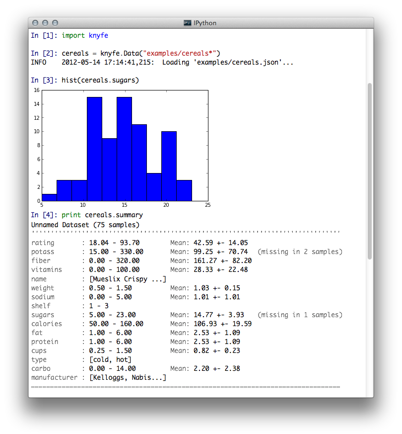
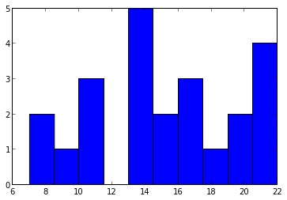

What is knyfe?
==============

knyfe is a python utility for rapid exploration of datasets. Use it when you have some kind of dataset and you want to get a feel for how it is composed, run some simple tests on it, or prepare it for further processing. The great thing about knyfe is that you don't have to know much about how your dataset is designed. You shouldn't have to remember in which variable resides in which column of your data matrix or how your `structs` are nested. Just get shit done.

Quickstart
----------

knyfe is awesome on it's own, but it's really good friends with the [iPython](http://ipython.org/) console. Just fire it up with `ipython qtconsole --pylab=inline` and get rockin':

    >>> cereals = knyfe.Data("examples/cereals.json")
    >>> print cereals.summary

    Unnamed Dataset (75 samples)
    ''''''''''''''''''''''''''''''''''''''''''''''''''''''''''''''''''''''''''''''''''
    rating       : 18.04 - 93.70         Mean: 42.59 +- 14.05   
    potass       : 15.00 - 330.00        Mean: 99.25 +- 70.74   (missing in 2 samples)
    fiber        : 0.00 - 320.00         Mean: 161.27 +- 82.20  
    vitamins     : 0.00 - 100.00         Mean: 28.33 +- 22.48   
    name         : [Mueslix Crispy ...]                         
    weight       : 0.50 - 1.50           Mean: 1.03 +- 0.15     
    sodium       : 0.00 - 5.00           Mean: 1.01 +- 1.01     
    shelf        : 1 - 3                                        
    sugars       : 5.00 - 23.00          Mean: 14.77 +- 3.93    (missing in 1 samples)
    calories     : 50 - 160                                     
    fat          : 1.00 - 6.00           Mean: 2.53 +- 1.09     
    protein      : 1.00 - 6.00           Mean: 2.53 +- 1.09     
    cups         : 0.25 - 1.50           Mean: 0.82 +- 0.23     
    type         : [cold, hot]                                  
    carbo        : 0.00 - 14.00          Mean: 2.20 +- 2.38     
    manufacturer : [Kelloggs, Nabis...]                         
    ==================================================================================

    >>> print set(cereals.manufacturer)
    set(['Kelloggs', 'Nabisco', 'Ralston Purina', 'Quaker Oats', 'Post', 'General Mills'])
    >>> kellogs_products = cereals.filter(manufacturer="Kellogs")
    >>> hist(kellogs_products)

    kellogs_products.export("kellogs.xls")

Loading Data
------------

Data objects can be created using

* Strings, interpreted as paths to JSON files
* dictionaries, interpreted as single samples
* lists of dictionaries
* other Data instances

So any of these will work:

    cereals = knyfe.Data("examples/cereals.json")
    all_examples = knyfe.Data("examples/*.json")
    bruce = knyfe.Data({"name": "Bruce Schneier", "awesomeness": 8.7})
    people = knyfe.Data([
      {"name": "Justin Bieber", "awesomeness": 1.3}, 
      {"name": "Nikolai Tesla", "awesomeness": 9.8}
    ])
    copy_of_singleton = knyfe.Data(singleton)

Exploring Data
--------------

At any time, you can print the `summary` of a data set to get a quick peek into what's inside:

    >>> print people.summary
    Unnamed Dataset (2 samples)
    ''''''''''''''''''''''''''''''''''''''''''''''''''''''
    awesomeness : 1.30 - 9.80          Mean: 5.55 +- 4.25     
    name        : [Nikolai Tesla, ...]                        
    ======================================================

`attributes` will give you all attributes in a dataset:

  >>> print people.attributes
  set(['awesomeness', 'name'])

You can access the values of an attribute using the `get` method, or the shorthand `.`-notation:

  >>> print people.get("awesomeness")
  [ 1.3,  9.8]
  >>> print people.awesomeness
  [ 1.3,  9.8]

Note that while `get` works on any attribute, the dot-notation requires attributes to look like valid python variables. In any case, the values returned will be a `numpy`-array. Note that if there are samples with missing values, the returned array will be shorter than the data set itself. You can tell `get` to replace missing values, though:

    >>> people += {"name": "The Yeti"}
    >>> print people.get("awesomeness")
    [ 1.3,  9.8]
   >>>  people.get("awesomeness", missing=NaN)
   [ 1.3,  9.8, nan]

Manipulating Data
-----------------

### Adding Data, Unions and Differences

The `+` and `-` operators work as expected:

    >>> yeti = {"name": "The Yeti"}
    >>> people += yeti                   # Adds 1 sample to people (now 3)
    >>> more_people = people + bruce     # Creates new Dataset with 4 samples
    >>> real_people = more_people - yeti # Creates new Dataset with Bruce, Nikoalai and Justin

### Filtering

But the real awesomeness happens in `filter`. Back to our cereals:

    >>> cereals.filter(manufacturer="Kellogs")

Will return a data set with only those samples from `cereals` where `manufacturer` is `Kellogs`. 

    >>> cereals.filter(shelf=(2,3))

will get all cereals with `shelf` being _either_ `2` or `3`, and 

    >>> cereals.filter("sugars")

will get all samples where the `sugars` attribute is present and does not evaluate to `False` (ie. is not `NaN` or `0`). More complex stuff can be done with functions like this:

    >>> cereals.filter(lambda c: 12.0 <= c['sugars'] < 15.0)

gets all the cereals that have between 12 and 15 grams of sugar.

### Daisy-chaining

Since `filter` returns a new data set, you can also chain methods:

    >>> cereals.filter(manufacturer="Kellogs").filter(shelf=(2,3))

Of course, you can also write 

    >>> cereals.filter(manufacturer="Kellogs", shelf=(2,3))

and get the same effect - but chaining methods allows you to do a few other operations in a single line.

### Other functions:

- `map`
- `median_split`
- `toggle_verbose`
- `remove_outliers`
- `label`
- `dependent_vars`

Saving and Exporting
--------------------

Saving to json is as easy as

    cereals.save("new_dataset.json")

But exporting is just as swift:

    cereals.save("excel_worksheet.xlsx")

knyfe will guess the format by the extension. 

### Formats

Currently following formats are supported.

- `csv` for comma separated value
- `xlsx` for Excel 07 or newer
- `xls` for legacy Excel
- `ods` for open document spreadsheet
- `html` for an html file

Native Datasets: JSON
---------------------

Natively, knyfe treats data like JSON objects, or, key value pairs. If you know what JSON is, skip this section.

### Why JSON?

Any data format should be constructed after three principles:

1. Human readable
2. Explict (ie. self-contained)
3. Flexible

In other words, a dataset shouldn't look like this: `PK\x03\x04\x14\x00\x00\x00\x00\x00\xce\xad` and it also shouldn't look like `5.1,3.5,1.4,0.2;4.6,3.1,1.5,0.2`. Why? For two reasons:

1. If other people want to use your data, the should know what they're dealing with.
2. Human readable means anybody will be able to open the data set, now and in 50 years.

### What does JSON look like?

If you know Python, JSON will look very familiar: it translates to Python `dict` and `list` types almost directly. The only difference is that `None` in Python is `null` in JSON, and keys don't have to be strings. So a Dataset in JSON may look like this:

  [
    {
      species: 'Elephant',
      weight: 8014.2,
      age: 31,
      name: 'Dumbo'
    },
    {
      species: 'Squirrel',
      weight: 0.021,
      age: .7,
      name: null
    }
  ]
